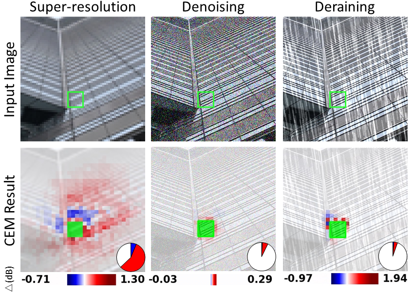

## [Interpreting Low-level Vision Models with Causal Effect Maps](https://arxiv.org/abs/2407.19789)<br>

> Jinfan Hu, Jinjin Gu, Shiyao Yu, Fanghua Yu, Zheyuan Li, Zhiyuan You, Chaochao Lu, Chao Dong<br>
> Shenzhen Institute of Advanced Technology; Shanghai Artificial Intelligence Laboratory; Southern University of Science and Technology; The Chinese University of Hong Kong <br>

<p align="center">
  
</p>

## Dependencies and Installation

1. Clone repo
    ```bash
    git clone https://github.com/J-FHu/CEM.git
    cd CEM
    ```

2. Install dependent packages
    ```bash
    conda create -n CEM python=3.8 -y
    conda activate CEM
    pip install --upgrade pip
    pip install -r requirements.txt
    ```

3. Download checkpoints

   Download the model checkpoints provided in either of the following links: [Google Drive](https://drive.google.com/drive/folders/1Ns6-LQNJSBzF6ke57vS3aeLnTQSGKxa_?usp=sharing) or [Baidu Netdisk](https://pan.baidu.com/s/1nb86GtKsNHHyHMmpASw13g?pwd=353p) 

   Place the downloaded checkpoints in the directory: ./CEM_Demo/ModelZoo/models/


## Quick Usage

1. Run the following command to generate Causal Effect Maps (CEMs)
    ```Shell
    export CUDA_VISIBLE_DEVICES=0
    # SR
    python demo_causal_effect_calculation.py --config demo-SR_CEM.yml
    python demo_CEM_generation.py --config demo-SR_CEM.yml
    # DR
    python demo_causal_effect_calculation.py --config demo-DR_CEM.yml
    python demo_CEM_generation.py --config demo-DR_CEM.yml
    # DN
    python demo_causal_effect_calculation.py --config demo-DN_CEM.yml
    python demo_CEM_generation.py --config demo-DN_CEM.yml
    ```
   
2. The hyperparameters of configure
      ``` YAML
      task: 'SR'                      # Task type: SR, DN, DR
      sr: 4                           # Scale factor for SR (1 for DN and DR)
      Modellist: ['EDSR', 'SRResNet'] # List of models
      batch_size_dict:                # Batch sizes based on GPU memory
        EDSR: 900
        SRResNet: 800
      TextImg_path: './CEM_Demo/test_images/Test1/' # Test image path
      Imagelist: ['demo_1.png', 'demo_3.png']      # List of test images
      patch_path: './patch-DIV2K-8-Demo'           # Intervention patch path
      prefix: 'DEMO'
   
      w: 96                     # Top-left corner (width) of ROI
      h: 152                    # Top-left corner (height) of ROI
      ROI_size: 32              # Size of the ROI
      mask_block_size: 8        # Size of intervention block
      coarse_num: 3             # Number of coarse-stage interventions
      fine_num: 50              # Number of fine-stage interventions
      load_previous: 1          # Load previous intervention results (1 = yes, 0 = no)
      tol: 0.01                 # Tolerance for causal effect difference
      ```
3. The result will be saved in ./{task}_{prefix}_Result.html

## Load Your Models
1. Place your model's Python file in the directory: [./CEM_Demo/ModelZoo/NN/](./CEM_Demo/ModelZoo/NN/)

2. Update the file [./CEM_Demo/ModelZoo/\_\_init__.py](./CEM_Demo/ModelZoo/__init__.py)
   - Add your **modelname** to [_NN_LIST_](./CEM_Demo/ModelZoo/__init__.py#L7)
   - Add your **modelname** and **corresponding checkpoint** to [_MODEL_LIST_](./CEM_Demo/ModelZoo/__init__.py#L81)
   - Import your model architecture in  [_get_model_](./CEM_Demo/ModelZoo/__init__.py#L370) function
   - Load model checkpoint in [_load_model_](./CEM_Demo/ModelZoo/__init__.py#L565) function

Note: For Denoising (DN) or Deraining (DR) tasks:
   - Use _get_denoise_model_ (or _get_derain_model_) instead of _get_model_
   - Use _load_denoise_model_ (or _load_derain_model_) instead of _load_model_

---
## Citation
If you find this project helpful, please consider citing:

    @article{hu2024interpreting,
      title={Interpreting Low-level Vision Models with Causal Effect Maps}, 
      author={Hu, Jinfan and Gu, Jinjin and Yu, Shiyao and Yu, Fanghua and Li, Zheyuan and You, Zhiyuan and Lu, Chaochao and Dong, Chao},
      year={2024},
      eprint={2407.19789},
      archivePrefix={arXiv},
    }
